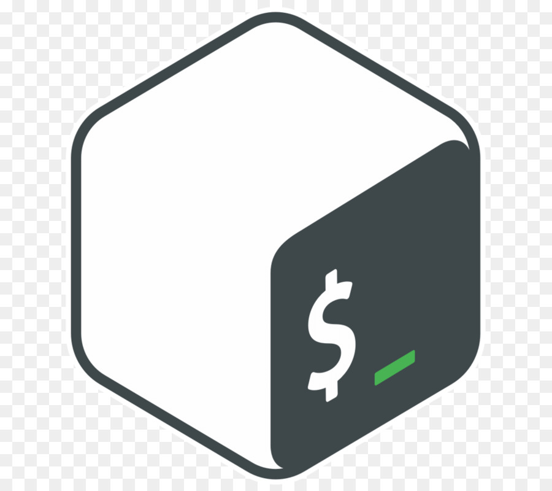
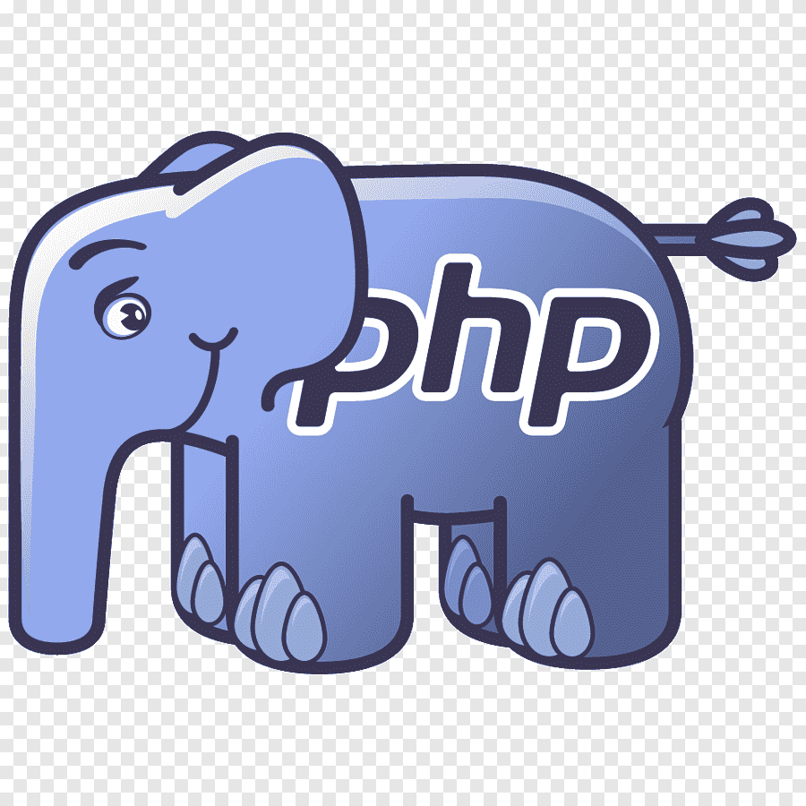
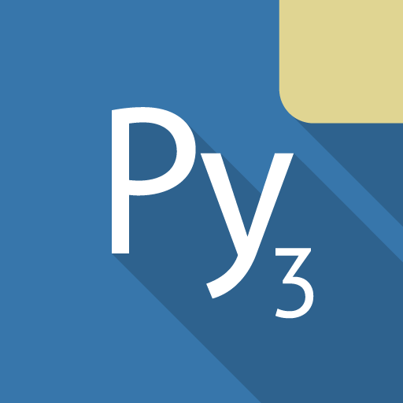
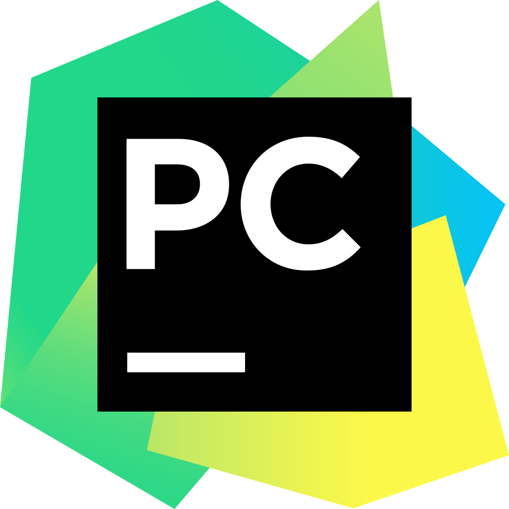
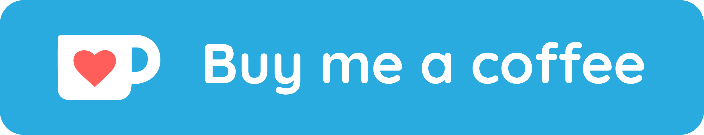

  
<h1 align="center">WELCOME TO MY PROFILE
  

<a href ="#"><src="https://img.shields.io/amo/stars/:addonId"></a>
  
 
 

### Languages and Tools:

 

## Find Me on :

# Buy me coffee starting at $ 1 via PayPal

[<code>

</code>](https://www.paypal.me/riadhat31)
